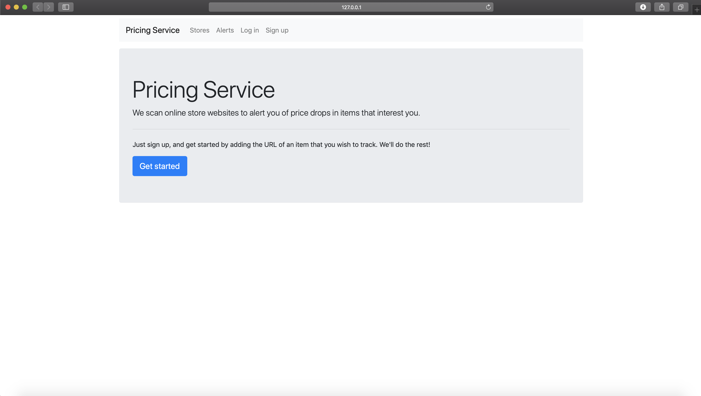
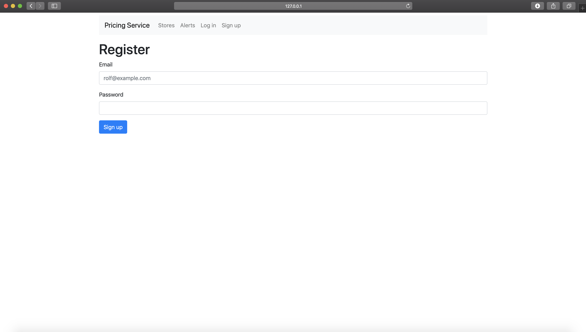
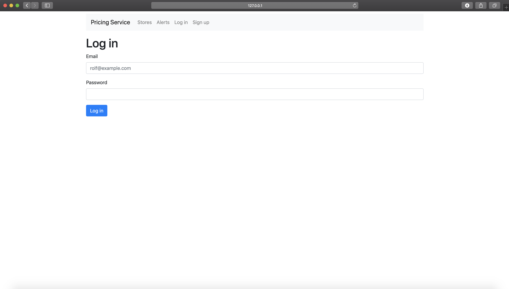
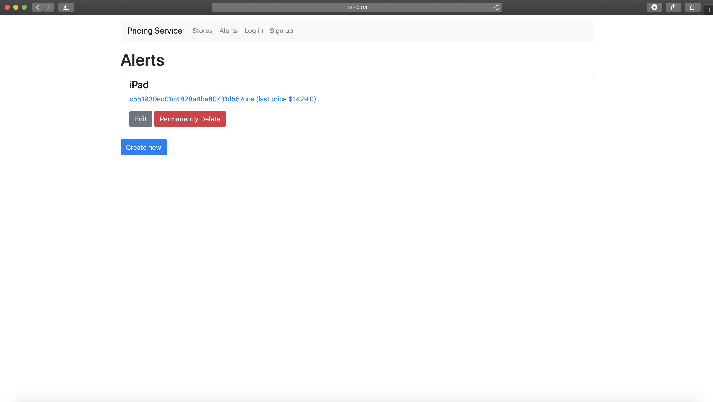
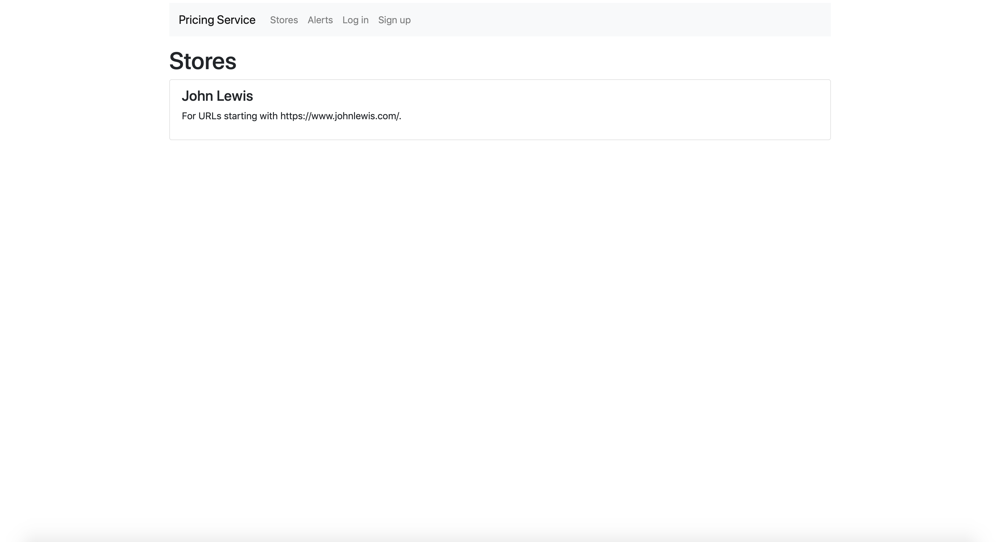

# Intro:

This is an application built to allow the periodic scanning of online stores, to notify users of changes in prices of items they select.

It allows the administrator (defined via `src/config.py`) to add, remove, and edit online stores.

You will need a Mailgun account and API details for the e-mailing to work.
E-mails are sent via executing the `src/alert_updater.py` file. In order to check e.g. every 10 minutes, the file must be executed every 10 minutes. This can be done with a cron job or a Windows service.

It parses the store websites using `requests` and `BeautifulSoup`.

It **does not work with Stores that dynamically inject content using JavaScript**.

It allows users to register, log in, and create and modify their alerts.

Technology stack: MongoDB, Python (Flask & Jinja2), HTML/CSS/Bootstrap, Mailgun.

## Installation

```bash
    conda create --name web_price_alert python=3.7 -y
    conda activate web_price_alert
    pip install -r requirements.txt
```

1. Clone the repository.
2. Define your administrator e-mail as the environment variable `APP_ADMIN` (or use `.env` file).
3. Define your Mailgun API details using environment variables `MAILGUN_URL`, `MAILGUN_API_KEY`, and `MAILGUN_FROM`.









